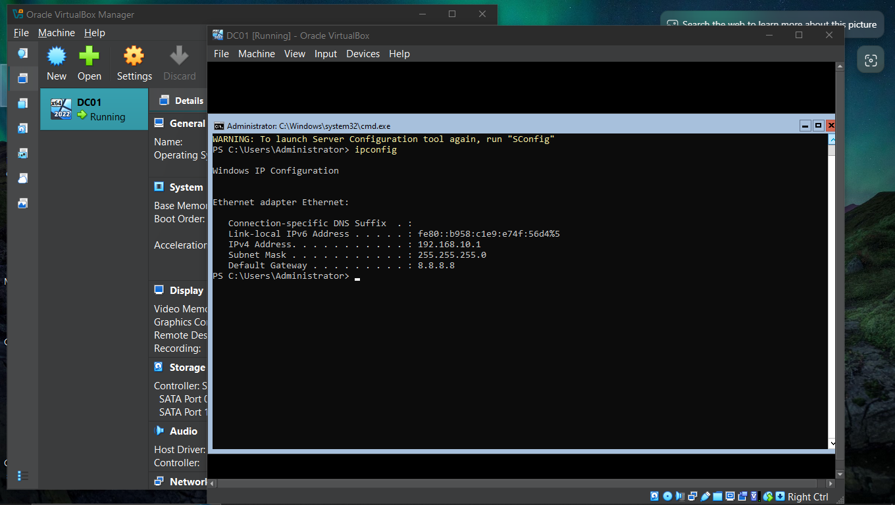
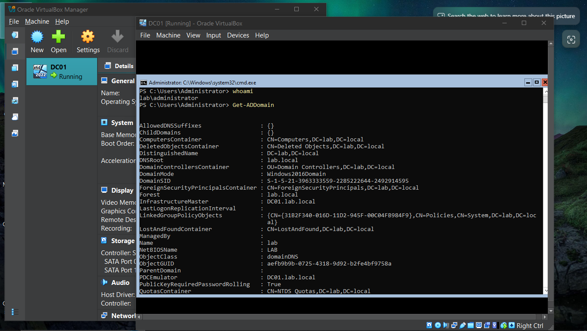
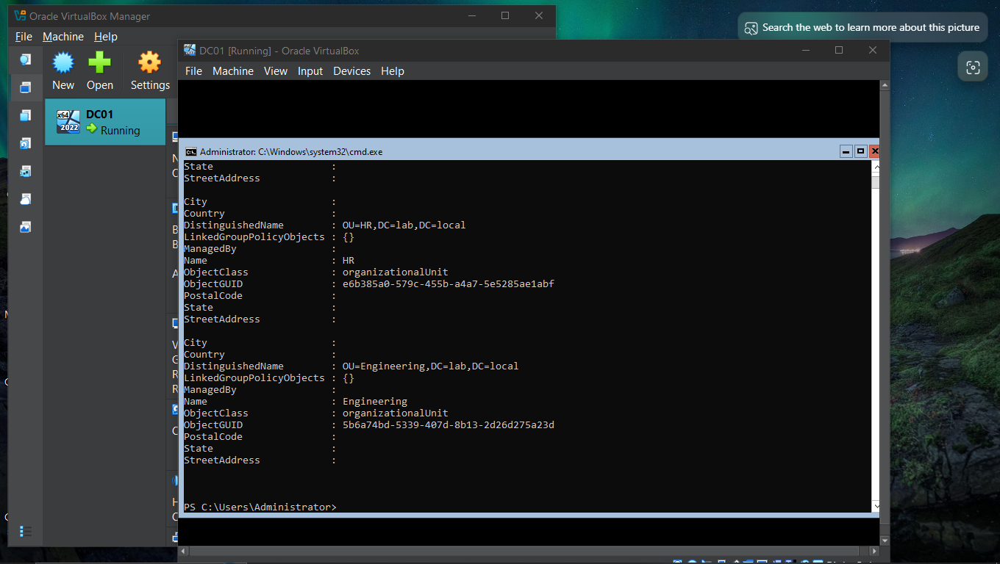

# Enterprise Active Directory & Identity Management Lab

A simulated corporate IT environment demonstrating core Windows Server administration:
domain controller setup, Organizational Unit design, and automated user provisioning via PowerShell.

## Status
✅ Phase 1 Complete: Domain controller, OUs, automated user import
🔜 Phase 2 In Progress: Client machine domain join + Group Policy enforcement

## Environment
- Hypervisor: Oracle VirtualBox (Internal Network mode, isolated lab)
- Domain Controller: Windows Server 2022 Standard (Server Core), hostname `DC01`
- Domain: lab.local
- Networking: Static IP (192.168.10.1/24), self-hosted DNS

What I built

1. Domain Controller Deployment
Installed Windows Server 2022 in Server Core mode (no GUI — matches how most production
DCs are actually run) inside VirtualBox, on an isolated internal network(To Avoid Ip COnflict). Configured static IP addressing and DNS entirely via `sconfig` and PowerShell, since Server Core has no
graphical tools.

2. Active Directory Domain Services
Promoted the server to a domain controller, standing up a new forest (`lab.local`) using:
powershell commands 
" install-WindowsFeature -Name AD-Domain-Services -IncludeManagementTools"
" Install-ADDSForest -DomainName "lab.local"

3. Organizational Unit Structure
   
Created department-based OUs to mirror how a real company segments users for targeted
policy application:

powershell Command
New-ADOrganizationalUnit -Name "Sales" -Path "DC=lab,DC=local"
New-ADOrganizationalUnit -Name "HR" -Path "DC=lab,DC=local"
New-ADOrganizationalUnit -Name "Engineering" -Path "DC=lab,DC=local"

4. Automated Bulk User Provisioning

   
Wrote a PowerShell script (`Import-Employees.ps1`) that reads a CSV of new hires
(simulating an HR export) and automatically creates their AD accounts in the correct
department OU, with forced password change at first login — a standard security practice.

**How it works:**
- Reads each row of `employees.csv`
- Dynamically builds the target OU path based on the employee's Department field
- Converts the plaintext password into a secure string (required by AD)
- Creates the account via `New-ADUser`, placing it directly in the right OU
- Enforces a password reset on first login

See [`Import-Employees.ps1`](./Import-Employees.ps1) for the full script.

## Skills demonstrated
Windows Server administration · Active Directory · PowerShell scripting ·
DNS configuration · Server Core (CLI-only administration) · Virtualization (VirtualBox) ·
Infrastructure documentation

## Coming in Phase 2
- Windows 10 client VM joined to the domain
- Group Policy Objects enforcing password complexity and desktop restrictions
- Screenshot proof of policy applying to a logged-in domain user
